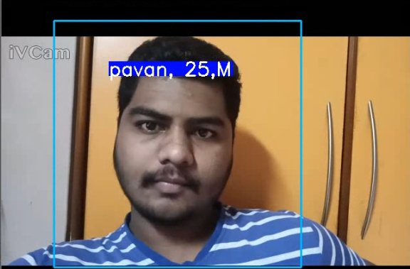

# Face-Recognition-Deep-Learning-

## FaceCapture.py
this code will capture 100 images   
**note:-** you have to create a directory naming "Images" in order to store that images

---
## face_Recognition.py
this code will train & save the model  
**note:-** make sure you created a proper dataset to train your model 
**_if not follow this steps_**: 
1.create a directory naming Datasets 
2.in directory Datasets create new directories 1.Train 2.Test 
3.split your images into 80,20 
4.add 80 images in train directory 
5.add 20 images in test directory 

---

## facefrontend.py
it will detect face and return your name

---

